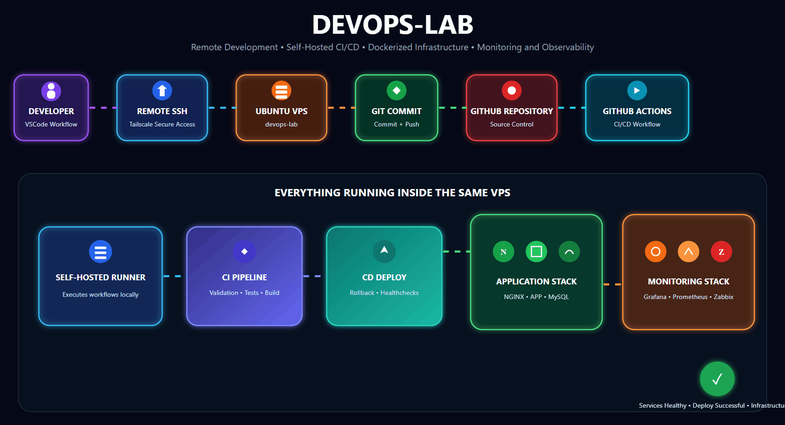
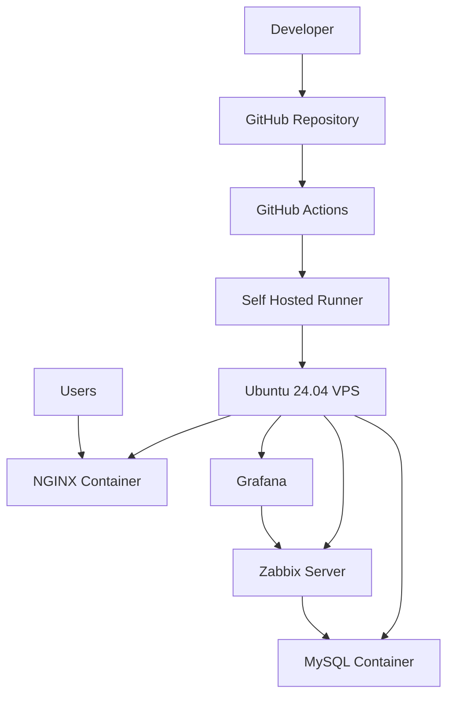

# 🚀 devops-lab


<p align="center">
  
</p>

Projeto de infraestrutura containerizada focado em práticas DevOps modernas, utilizando deploy automatizado, observabilidade, monitoramento, rollback automático e pipelines CI/CD desacopladas.

O ambiente foi desenvolvido para estudo prático e evolução contínua em:

- DevOps
- Containers
- Observabilidade
- CI/CD
- Troubleshooting Linux
- Automação
- Infraestrutura
- Deploy seguro

---

# 📌 Objetivo do Projeto

O objetivo deste laboratório é simular um ambiente DevOps real utilizando:

- aplicação containerizada
- monitoramento
- pipelines automatizadas
- rollback automático
- deploy segregado
- segurança básica
- troubleshooting operacional

O projeto foi construído visando aprendizado prático em:
- automação de infraestrutura
- gerenciamento de containers
- monitoramento de serviços
- integração contínua
- entrega contínua
- troubleshooting de ambientes Linux

---

# 🏗️ Arquitetura



# 🧰 Stack Utilizada

## Infraestrutura
- Docker
- Docker Compose
- NGINX
- Linux Ubuntu 24.04

## Observabilidade
- Grafana
- Zabbix

## Banco de Dados
- MySQL

## CI/CD
- GitHub Actions
- Self Hosted Runner

## Segurança
- HTTPS
- TLS
- Variáveis de ambiente
- GitHub Secrets
- Firewall
- Tailscale SSH Access

## Gerenciamento
- Portainer (uso inicial)
- VSCode
- Terminal Linux

# 📂 Estrutura do Projeto

```bash
devops-lab/
├── app/
│   ├── Dockerfile
│   ├── docker-compose.yml
│   ├── site/
│   │   └── index.html
│   └── nginx/
│      └── nginx.conf
│
├── monitoring/
│   ├── grafana/
│   │   └── provisioning/
│   │
│   ├── zabbix/
│   │
│   └── docker-compose.yml
│
├── deploy/
│   ├── app/
│   │   └── deploy.sh
│   │
│   └── monitoring/
│       └── deploy-monitoring.sh
│
├── scripts/
│   └── generate-cert.sh
│
├── environments/
│   ├── .env
│   └── .env.example
│
├── .github/
│   └── workflows/
│       ├── ci.yml
│       ├── app-cd.yml
│       └── monitoring-cd.yml
│
├── docs/
│   ├── estrutura.txt
│   └── architecture.md
│
├── .gitignore
├── README.md
└── .last_deploy
```

# ⚙️ Funcionalidades Implementadas

## ✅ Infraestrutura
- Ambiente totalmente containerizado
- Deploy modularizado
- Compose segregado por responsabilidade
- Volumes persistentes
- TLS local
- Reverse Proxy com NGINX

## ✅ Observabilidade
- Monitoramento em tempo real
- Dashboards Grafana
- Integração Zabbix + MySQL
- Logs centralizados
- Healthchecks
- Alertas

## ✅ CI/CD
- CI separado para validação
- Deploy desacoplado entre aplicação e observabilidade
- Build automatizado
- Docker build automatizado
- Pull Request validation
- Branch protection workflow
- Self-hosted runner
- Deploy via SHA

## ✅ Segurança
- Uso de `.env`
- GitHub Secrets
- HTTPS com TLS
- SSH privado via Tailscale
- Firewall configurado

## ✅ Deploy Inteligente
- Deploy condicional utilizando paths
- Deploy executado apenas quando arquivos específicos sofrem alteração
- Rollback automático
- Verificação de integridade via curl -fsS

## 🔄 Estratégia de Rollback

O projeto possui rollback automático baseado em verificação de disponibilidade da aplicação.

### Após o deploy:

```bash
if ! curl -fsS http://localhost > /dev/null; then
```

### Caso a aplicação falhe:

- o deploy é invalidado
- a imagem anterior é restaurada automaticamente
- o ambiente retorna para a última versão funcional

### Estratégia utilizada:

- deploy por SHA
- armazenamento da versão anterior
- rollback automático em falha

## 🔁 CI/CD Pipeline
## 🔹 CI Pipeline

### Responsável por:

- validação
- build
- testes
- verificação de integridade

### Fluxos:

- Pull Requests
- branch main

## 🔹 Application CD

### Responsável por:

- deploy da aplicação NGINX
- atualização de imagem
- rollback automático
- validação pós deploy
## 🔹 Monitoring CD

### Responsável por:

- deploy da stack observabilidade
- atualização independente
- isolamento operacional

## 🔹 Self Hosted Runner

### Runner dedicado com labels:

- self-hosted
- Linux
- infra-dev

### Objetivos:

- maior controle operacional
- ambiente customizado
- testes reais de infraestrutura

## 🐳 Docker Hub

### Imagem publicada:

- guifranco/devops-lab

### Versionamento realizado utilizando:

- SHA do GitHub
- latest
- rollback tracking

# 🔒 Segurança

### Implementado

- HTTPS/TLS
- Certificados locais
- GitHub Secrets
- Firewall Linux
- SSH privado via Tailscale

# 🌐 Rede e Acesso

### Acesso remoto realizado via:

- Tailscale VPN
- SSH privado
- comunicação segura entre ambientes

### Sistema operacional utilizado:

- Ubuntu 24.04 Minimal

# 🧪 Troubleshooting Realizado

 Durante o desenvolvimento do laboratório foram resolvidos diversos problemas operacionais reais:

## 🛠️ Docker Networking

### Problemas relacionados:

- UFW
- ALLOW/DENY GROUP
- Cloud Init
- SSH via Tailscale

## 🛠️ Persistência de Volumes

### Problemas:

- volumes com hashes aleatórias
- inconsistência de persistência

### Solução:

refatoração da estrutura de volumes

# 🛠️ MySQL + Zabbix

### Problema:

- incompatibilidade com MySQL 8.4.6

### Solução:

- downgrade para MySQL 8.0.36

# 🛠️ Variáveis de Ambiente

 ### Problema:

- .env vazio causando falha no deploy

### Solução:

- implementação de symlink para leitura correta

# 🛠️ Segurança

### Problema:

- vazamento inicial de `.env`

### Solução:

- remoção do repositório
- refatoração
- uso correto de secrets

# 🛠️ Linux Troubleshooting

### Resolução de:

- permissões
- conflitos de portas
- reverse proxy
- networking
- containers não saudáveis
- restart policies

# 📈 Aprendizados

## Este laboratório proporcionou prática real em:

- DevOps
- Docker
- Linux
- Observabilidade
- CI/CD
- Monitoramento
- Troubleshooting
- Deploy automatizado
- Segurança
- Redes
- Containers
- Automação

# 🚀 Roadmap Futuro

## Planejamento de evolução:

- Prometheus
- Node Exporter
- cAdvisor
- Loki
- Terraform
- Kubernetes
- GitOps
- ArgoCD
- Backup automatizado MySQL
- Observabilidade avançada
- Deploy multi ambiente

# ▶️ Como Executar

Clonar repositório
```bash
git clone https://github.com/guilhermefranco0013/devops-lab.git
```

Subir aplicação

```bash
cd app
docker compose up -d
```

Subir monitoramento

```bash
cd monitoring
docker compose up -d
```

# 📊 Destaques Técnicos

- Principais diferenciais do projeto
- rollback automático
- self-hosted runner
- deploy desacoplado
- troubleshooting real
- observabilidade
- deploy condicional
- TLS
- integração GitHub Actions
- pipelines separadas
- deploy por SHA
- modularização
- segurança básica aplicada
- gerenciamento Linux real

# 👨‍💻 Autor
## Guilherme Franco

Projeto desenvolvido com foco em evolução prática na área de DevOps e Cloud Infrastructure.

GitHub: [guilhermefranco0013](https://github.com/guilhermefranco0013)


