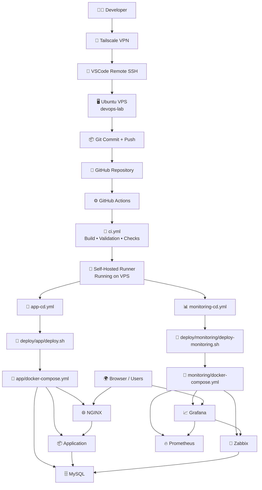

```mermaid
flowchart TD

%% =========================
%% DEVELOPMENT FLOW
%% =========================

DEV[👨‍💻 Developer]
TAIL[🔐 Tailscale VPN]
VSCODE[🧠 VSCode Remote SSH]
VPS[🖥️ Ubuntu VPS<br/>devops-lab]

DEV --> TAIL
TAIL --> VSCODE
VSCODE --> VPS

%% =========================
%% GIT FLOW
%% =========================

GIT[📦 Git Commit + Push]
GH[🐙 GitHub Repository]

VPS --> GIT
GIT --> GH

%% =========================
%% GITHUB ACTIONS
%% =========================

GHA[⚙️ GitHub Actions]

CI[🧪 ci.yml<br/>Build • Validation • Checks]

APPCD[🚀 app-cd.yml]
MONCD[📊 monitoring-cd.yml]

RUNNER[🏃 Self-Hosted Runner<br/>Running on VPS]

GH --> GHA

GHA --> CI
CI --> RUNNER

RUNNER --> APPCD
RUNNER --> MONCD

%% =========================
%% DEPLOY SCRIPTS
%% =========================

APPDEPLOY[📜 deploy/app/deploy.sh]
MONDEPLOY[📜 deploy/monitoring/deploy-monitoring.sh]

APPCD --> APPDEPLOY
MONCD --> MONDEPLOY

%% =========================
%% DOCKER COMPOSE STACKS
%% =========================

APPCOMPOSE[🐳 app/docker-compose.yml]
MONCOMPOSE[🐳 monitoring/docker-compose.yml]

APPDEPLOY --> APPCOMPOSE
MONDEPLOY --> MONCOMPOSE

%% =========================
%% APPLICATION STACK
%% =========================

NGINX[🌐 NGINX]
APP[📦 Application]
MYSQL[🗄️ MySQL]

APPCOMPOSE --> NGINX
APPCOMPOSE --> APP
APPCOMPOSE --> MYSQL

NGINX --> APP
APP --> MYSQL

%% =========================
%% MONITORING STACK
%% =========================

GRAFANA[📈 Grafana]
ZABBIX[📡 Zabbix]
PROM[🔥 Prometheus]

MONCOMPOSE --> GRAFANA
MONCOMPOSE --> ZABBIX
MONCOMPOSE --> PROM

GRAFANA --> PROM
GRAFANA --> ZABBIX
ZABBIX --> MYSQL

%% =========================
%% USERS
%% =========================

USERS[🌍 Browser / Users]

USERS --> NGINX
USERS --> GRAFANA
```